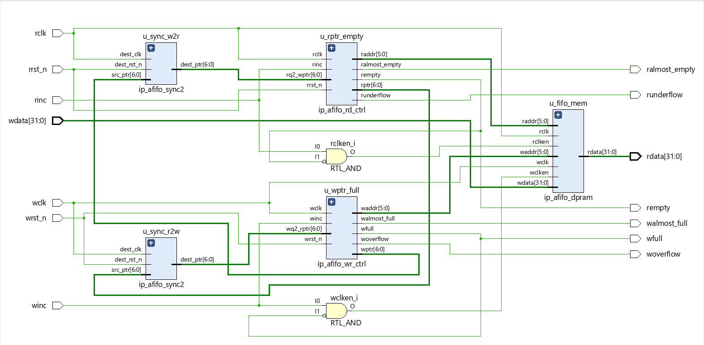
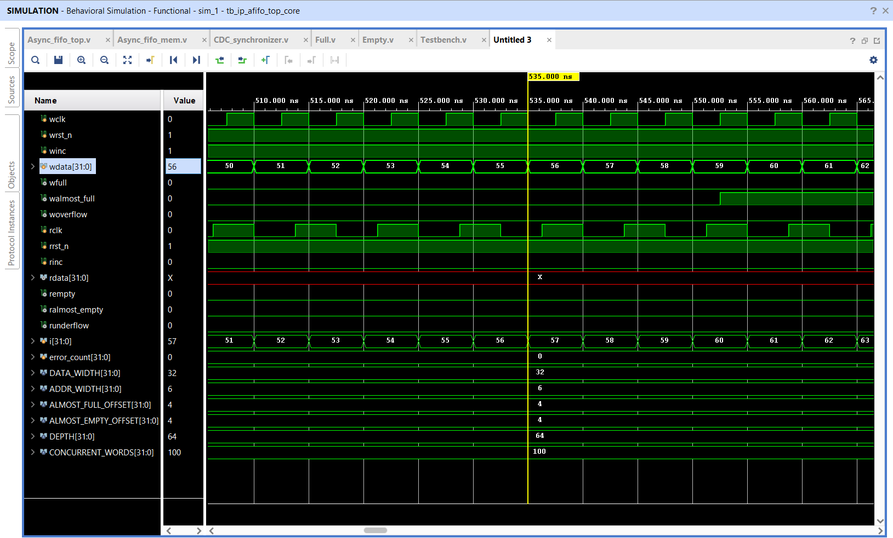
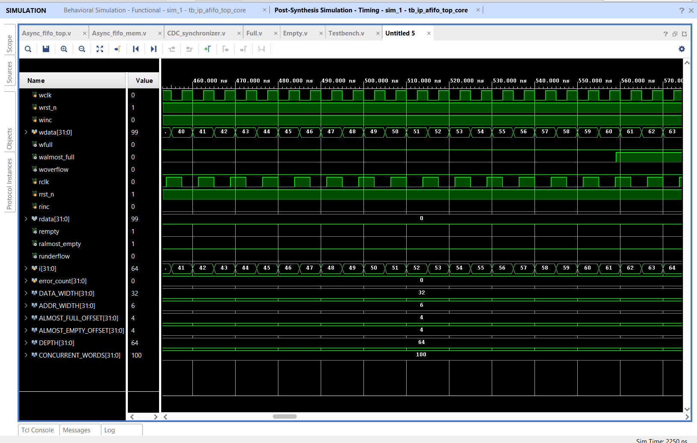
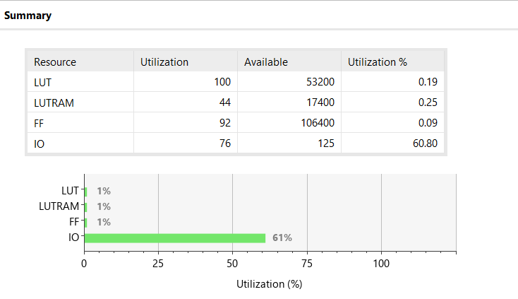
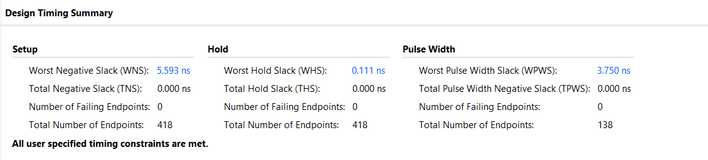

<h1 align="center">Dual-Clock Asynchronous FIFO</h1>

<i>A parameterizable, CDC-safe FIFO for bridging independent read/write clock domains</i>

---

## Author

**Neelava Mukherjee**
- **M.Tech**, Electrical Engineering (Integrated Circuits and Systems) — Indian Institute of Technology Bombay (2027)
- **B.E.**, Electrical Engineering — Jadavpur University (2025)

---

## Table of Contents

1. [Introduction](#introduction)
2. [Detailed Design & Architecture](#detailed-design--architecture)
3. [Elaborated RTL Schematic](#elaborated-rtl-schematic)
4. [Signal Definitions](#signal-definitions)
5. [Module Breakdown](#module-breakdown)
6. [Testbench Implementation & Verification Strategy](#testbench-implementation--verification-strategy)
7. [Verification & Simulation Results](#verification--simulation-results)
8. [Synthesis & Timing Closure](#synthesis--timing-closure)
9. [Conclusion](#conclusion)
10. [References](#references)

---

## Introduction

This repository contains a parameterizable **Dual-Clock Asynchronous FIFO** implemented in Verilog.

When transferring data between two independent clock domains, differences in clock speed and unpredictable phase alignment can cause data loss or metastability at the receiving flip-flops. This project implements a reliable FIFO buffer that safely bridges such asynchronous clock domains using industry-standard Clock Domain Crossing (CDC) techniques.

### Key Highlights

| Feature | Description |
|---|---|
| **CDC Safety** | 2-stage Gray code pointer synchronizers prevent metastability across domains |
| **Status Flags & Error Handling** | Accurately tracks `full`, `empty`, `almost_full`, `almost_empty`, `overflow`, and `underflow` conditions |
| **Parameterized RTL** | Configurable data width and buffer depth (e.g., 64×32 or 256×32) |
| **Verified & Synthesized** | Validated with a self-checking testbench and synthesized on AMD Xilinx Vivado with zero timing violations |

---

## Detailed Design & Architecture

The architecture of this Asynchronous FIFO is carefully structured to safely transfer data between independent, unsynchronized clock domains — specifically bridging a **100 MHz write domain** and an **80 MHz read domain**. Below is a comprehensive breakdown of the core mechanics, signals, and submodules that drive the design.

### Read and Write Operations

In this dual-clock system, data injection and extraction are completely decoupled and governed by two independent state machines:

- **Writing:** The write operation is governed by the 100 MHz write clock (`wclk`). A write pointer dynamically tracks the next available memory address. When the write increment signal (`winc`) is asserted and the FIFO is not full, data is written into the buffer on that clock edge, and the pointer advances to the next address.
- **Reading:** The read operation is governed by the 80 MHz read clock (`rclk`). A read pointer tracks the oldest unread data in the buffer. Upon reset, both pointers initialize to zero. As data populates the FIFO, the read pointer immediately exposes the first valid word on the read data bus. Asserting the read increment signal (`rinc`) advances the pointer to fetch the subsequent word on the next clock edge.

### The Extra-Bit (N+1) Tracking for Full/Empty Conditions

For a FIFO depth of 64 words, a standard address requires 6 bits (2⁶ = 64). However, the internal pointers are sized at **7 bits** (`[6:0]`). This extra Most Significant Bit (MSB) is the **"wrap bit,"** which acts as a lap counter used to disambiguate between a completely full and a completely empty buffer — two states that would otherwise produce an identical 6-bit address match.

- **Empty Condition:** The FIFO is completely empty when the read pointer and write pointer are identically matched, *including* the extra wrap bit. This occurs immediately after reset, or whenever the slower read domain successfully consumes all available data and "catches up" to the write domain.
- **Full Condition:** The FIFO is saturated when the write pointer has looped entirely around the memory array and caught up to the read pointer from behind. In this state, the lower 6 bits (the physical address) of both pointers match, but their 7th bits (the wrap bits) are inverted relative to each other — indicating that the write domain has completed exactly one more lap of the buffer than the read domain.

### Gray Code Synchronization

Directly synchronizing a multi-bit binary counter across an asynchronous clock boundary is dangerous because individual bits can arrive at the destination flip-flops at slightly different times due to routing and clock skew. If several bits are transitioning simultaneously, the receiving domain risks sampling an intermediate, invalid combination of bits — corrupting the pointer value.

To eliminate this hazard, binary pointers are converted into **Gray code** before crossing the clock domain boundary. In a Gray code sequence, only a **single bit** changes state on any given increment. Consequently, if the receiving clock edge samples the signal at the exact instant it is changing, it can only ever capture either the old valid pointer value or the new valid pointer value — never an invalid intermediate combination. This property is what makes Gray-coded pointers, combined with a synchronizer, safe for crossing clock domains.

---

## Elaborated RTL Schematic

  

---

## Signal Definitions

Below are the critical signals mapped in the top-level wrapper.

### Write Domain (100 MHz)

| Signal | Description |
|---|---|
| `wclk` / `wrst_n` | Write domain clock and active-low asynchronous reset |
| `winc` | Write increment command |
| `wdata` | 32-bit input data bus |
| `wfull` | Asserts high when the FIFO cannot accept more data |
| `walmost_full` | Early warning flag asserted when the FIFO is within 4 words of capacity |
| `woverflow` | Error flag asserted if a write is illegally attempted while the FIFO is full |

### Read Domain (80 MHz)

| Signal | Description |
|---|---|
| `rclk` / `rrst_n` | Read domain clock and active-low asynchronous reset |
| `rinc` | Read increment command |
| `rdata` | 32-bit output data bus |
| `rempty` | Asserts high when no valid data is available to read |
| `ralmost_empty` | Early warning flag asserted when the FIFO is within 4 words of being empty |
| `runderflow` | Error flag asserted if a read is illegally attempted while the FIFO is empty |

### Internal Cross-Domain Routing

| Signal | Description |
|---|---|
| `wptr` / `rptr` | Gray-coded pointers originating from their respective domains |
| `rq2_wptr` | The write pointer, safely synchronized into the read domain (used for empty logic) |
| `wq2_rptr` | The read pointer, safely synchronized into the write domain (used for full logic) |

---

## Module Breakdown

The system is partitioned into five specialized modules to isolate the memory, domain logic, and synchronization stages. This modularity ensures clean synthesis mapping and a manageable static timing analysis (STA) constraint set.

### 1. Top Core — `Async_fifo_top.v` (`ip_afifo_top_core`)
The top-level integration wrapper. It instantiates the memory buffer, the read/write controllers, and the two CDC synchronizers. It routes the synchronized Gray pointers across the domain boundary and propagates the parameterized constraints (data width, address width, almost-full/almost-empty offsets) down to all submodules.

### 2. Distributed RAM Memory — `Async_fifo_mem.v` (`ip_afifo_dpram`)
The physical storage engine of the FIFO. It acts as a dual-port RAM, allowing simultaneous access from the 100 MHz write domain and the 80 MHz read domain. By using the `(* ram_style = "distributed" *)` synthesis attribute, the tool maps this 64×32 storage array directly into FPGA LUTs (LUTRAM) rather than consuming larger Block RAM primitives.

### 3. 2-Stage Synchronizer — `CDC_synchronizer.v` (`ip_afifo_sync2`)
This module is instantiated twice — once for the write-to-read path and once for the read-to-write path. It cascades two D flip-flops to combat metastability: the first flip-flop captures the incoming asynchronous Gray-coded pointer, and the second flip-flop stabilizes it before it is used by the destination domain's control logic.

### 4. Write Controller — `Full.v` (`ip_afifo_wr_ctrl`)
Driven entirely by `wclk`, this module manages the write memory address. It converts the internal binary write count into Gray code for safe transmission across the boundary, and continuously compares the active write pointer against the synchronized read pointer (`wq2_rptr`) to compute the `wfull`, `walmost_full`, and `woverflow` status flags.

### 5. Read Controller — `Empty.v` (`ip_afifo_rd_ctrl`)
Driven entirely by `rclk`, this module manages the read memory address. Similar to the write controller, it tracks the binary read location and converts it to Gray code. It compares its active read pointer against the synchronized write pointer (`rq2_wptr`) to evaluate data availability, driving the `rempty`, `ralmost_empty`, and `runderflow` status flags.

---

## Testbench Implementation & Verification Strategy

Verifying an asynchronous FIFO requires more than confirming that data goes in and comes out correctly. The testbench must prove that the design can handle independent, non-aligned clock domains, prevent data corruption during simultaneous read/write activity, and accurately report all boundary states.

The provided Verilog testbench (`Testbench.v`, `tb_ip_afifo_top_core`) uses a self-checking architecture to validate the FIFO across three distinct operational phases, fully automating pass/fail evaluation without requiring manual waveform inspection.

### 1. Clock Generation & Emulation

The testbench models the dual-clock environment by generating two independent, non-aligned clocks:
- **Write Clock (`wclk`):** Toggles to emulate the 100 MHz source domain.
- **Read Clock (`rclk`):** Toggles to emulate the slower 80 MHz destination domain.

Because these clocks are not phase-aligned, the testbench inherently subjects the RTL to real-world CDC stress on every clock edge.

### 2. The `assert_eq` Self-Checking Mechanism

To eliminate human error during verification, the testbench uses a custom `assert_eq` task. This task compares the expected behavioral output against the actual RTL output at specific simulation timestamps. On a mismatch, it logs a formatted error message to the console and increments a global `error_count`. At the end of simulation, the testbench automatically reports a `[ PASS ]` or the exact number of failures.

### 3. Verification Phases

**Phase 1 — Reset & Default State Checks**
Before any data is introduced, the testbench asserts the asynchronous active-low resets (`wrst_n` and `rrst_n`) and validates the baseline combinational logic:
- Confirms `rempty` and `ralmost_empty` are strictly asserted high (`1`).
- Confirms `wfull` and `walmost_full` are deasserted (`0`).
- Confirms error flags (`woverflow`, `runderflow`) are cleared.

**Phase 2 — Saturation & Error Injection (Boundary Testing)**
This phase tests the extreme edges of the 64-word buffer.
- *Write Saturation:* The testbench drives exactly 64 sequential writes into the FIFO, then asserts that `wfull` and `walmost_full` transition high.
- *Overflow Trapping:* While the FIFO is full, the testbench intentionally forces an illegal write transaction (injecting `32'hABCDEF99`), then verifies that the FIFO protects its memory and correctly asserts the `woverflow` error flag.
- *Read Draining:* The testbench switches to the read domain and extracts all 64 words, using the `assert_eq` task on every clock cycle to ensure the sequential data matches exactly what was written.
- *Underflow Trapping:* Once `rempty` is asserted, the testbench forces an illegal read and verifies that the `runderflow` flag catches the violation.

**Phase 3 — Asynchronous Concurrent Traffic (Stress Testing)**
Testing isolated writes and reads in isolation is insufficient for an asynchronous FIFO. The true test of the Gray code synchronizers occurs when both pointers are moving simultaneously.
- *The `fork ... join` Block:* The testbench uses Verilog's `fork...join` construct to spawn two parallel execution threads.
- *Simultaneous Operations:* One thread continuously injects data into the write domain while the other continuously extracts data from the read domain.
- *Dynamic Backpressure:* Both threads are backpressure-aware — the write thread checks `if (!wfull)` before writing, and the read thread checks `if (!rempty)` before reading.
- *Data Integrity:* Even as the read and write pointers chase each other across the asynchronous clock boundary, the read thread maintains a tracking index to guarantee that every word pulled from the concurrent stream matches the exact sequence injected by the write thread.

---

## Verification & Simulation Results

The asynchronous FIFO design was rigorously verified using a self-checking testbench. Based on the behavioral and post-synthesis timing simulations, the following key results were validated:

- **Data Integrity & Retrieval:** The FIFO correctly stored and retrieved data across the 100 MHz and 80 MHz clock domains without any data loss or corruption. Throughout both sequential and concurrent stress tests, the internal `error_count` remained at exactly **0**.
- **Accurate Boundary Detection:** The status flags behaved exactly as designed. Simulations confirm that the `walmost_full` flag precisely asserts at word 60 (based on a depth of 64 and an offset of 4). The `wfull` flag correctly engages at absolute capacity, blocking additional writes and preventing memory overflow.
- **Post-Synthesis Consistency:** The post-synthesis timing simulation mirrored the behavioral logic exactly, confirming that the translated gate-level netlist functions correctly under real hardware delays with no synchronization glitches.

### Behavioral Simulation Waveform

  

### Post-Synthesis Timing Simulation Waveform

  

---

## Synthesis & Timing Closure

The RTL was synthesized using AMD Xilinx Vivado. The design achieved complete timing closure with a highly efficient logic footprint. By using the `distributed` RAM attribute, the synthesis tool mapped the storage array to LUTRAM rather than consuming larger Block RAM primitives.

### Resource Utilization

| Resource | Utilization |
|---|---|
| LUT | 100 (0.19%) |
| LUTRAM | 44 (0.25%) |
| Registers (FF) | 92 (0.09%) |
| IO | 76 (60.80%) |

### Timing Summary

| Metric | Result |
|---|---|
| Worst Negative Slack (WNS) | +5.593 ns (Setup Clean) |
| Worst Hold Slack (WHS) | +0.111 ns (Hold Clean) |
| Worst Pulse Width Slack (WPWS) | +3.750 ns |
| Failing Endpoints | 0 / 418 |

*All user-specified timing constraints across the asynchronous domains were successfully met.*

  

  

---

## Conclusion

The design and implementation of the Dual-Clock Asynchronous FIFO were highly successful, demonstrating reliable cross-domain data transfer and robust Clock Domain Crossing (CDC) safety. The use of Gray code pointers and 2-stage synchronizers ensured mathematically sound synchronization, while the internal logic accurately protected the memory boundaries against overflow and underflow conditions.

While timing simulations confirm the functional and setup/hold aspects of the design, it is important to acknowledge that metastability is ultimately a physical hardware phenomenon that cannot be fully captured in simulation. The next phase of this project involves deploying the netlist onto a physical FPGA development board to observe real-world silicon behavior under extended, heavy-load concurrent traffic. Overall, this IP block is lightweight, highly efficient, and well suited for SoC applications requiring safe buffering between independent clock domains.

---

## References

Cummings, C. E., & Alfke, P. (2002). *Simulation and Synthesis Techniques for Asynchronous FIFO Design with Asynchronous Pointer Comparisons.* SNUG (Synopsys Users Group), San Jose.
